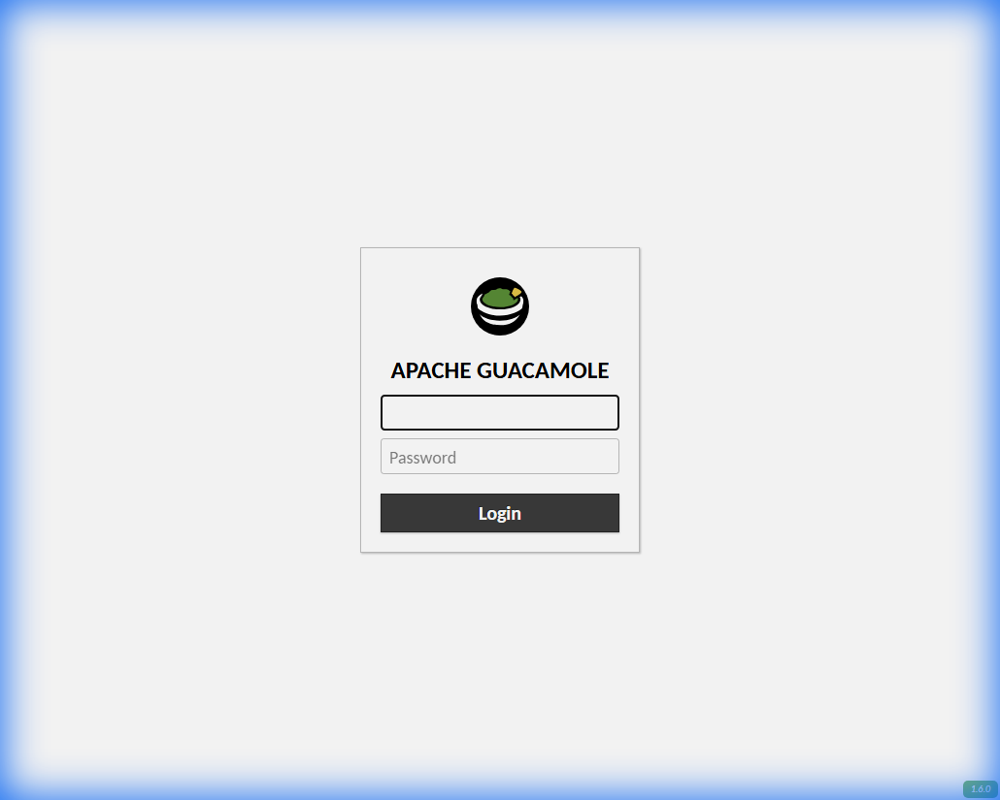

# Apache Guacamole Docker Setup

A Docker Compose configuration for running Apache Guacamole with PostgreSQL.

## Overview
This setup runs:
- **Guacamole Client**: Web interface running on port `8080`.
- **Guacd**: Proxy daemon for handling remote connections.
- **PostgreSQL**: Database for storing user configuration and connection details.

## Quick Start

1.  **Clone the repository:**
    ```bash
    git clone https://github.com/MacReyhan/guacamole-docker.git
    cd guacamole-docker
    ```

2.  **Start the services:**
    ```bash
    docker-compose up -d
    ```

3.  **Access Guacamole:**
    - Local: [http://localhost:8080/guacamole/](http://localhost:8080/guacamole/)
    - Network: `http://<YOUR_IP>:8080/guacamole/`
    
    **Default Credentials:** `guacadmin` / `guacadmin`

    > **Important:** Change the default password immediately after logging in.

## Validation Service


## Troubleshooting / fixes
- **500 Internal Server Error**: If you see this, check that the database initialized correctly. The `initdb.sql` provided here uses the correct `--postgresql` flag.
- **Environment Variables**: This setup uses `POSTGRESQL_*` (e.g. `POSTGRESQL_HOSTNAME`) which is required for newer Guacamole images, replacing the deprecated `POSTGRES_*`.

## License
MIT
